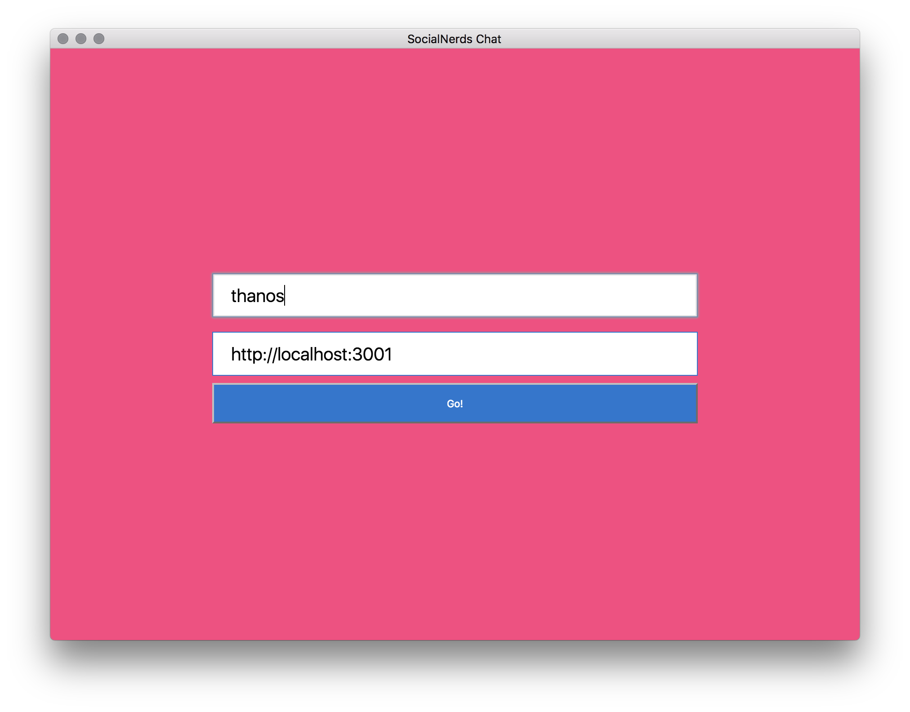
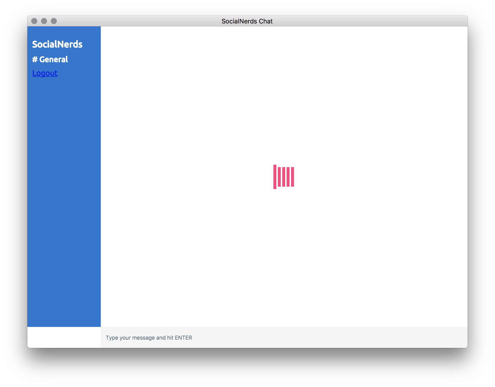
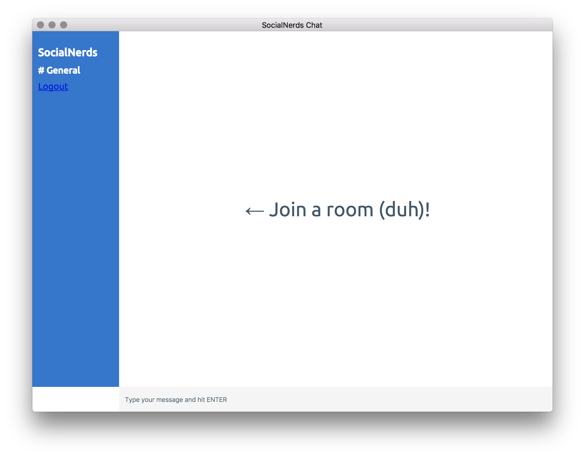
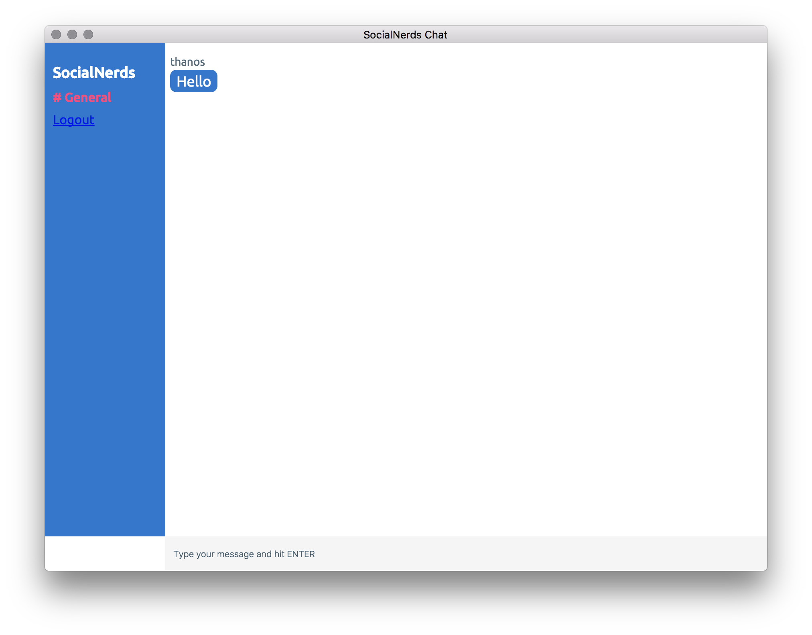

# Slack App episode 60
Slack wanna be clone app using Electron, React and Chatkit.
Watch the live video [here](https://youtu.be/Q_jtsyfJnZE).

# Installation
```
git clone https://github.com/SocialNerds/slack-clone-app-episode-60.git slack-app
cd slack-app
yarn install
Sign up [here](https://pusher.com/chatkit)
Create a new project and grab the tokens
Add your instanceLocator in src/config.js
Add key and instanceLocator in server.js
node server.js
yarn start
```







## Read more
- [Medium article](https://medium.com/@kitze/%EF%B8%8F-from-react-to-an-electron-app-ready-for-production-a0468ecb1da3)
- [YouTube video](https://www.youtube.com/watch?v=6vcIW0CO07k)
- [Scrimba lesson](https://scrimba.com/g/greactchatkit)

# By SocialNerds
* [SocialNerds.gr](https://www.socialnerds.gr/)
* [YouTube](https://www.youtube.com/SocialNerdsGR)
* [Facebook](https://www.facebook.com/SocialNerdsGR)
* [Twitter](https://twitter.com/socialnerdsgr)
